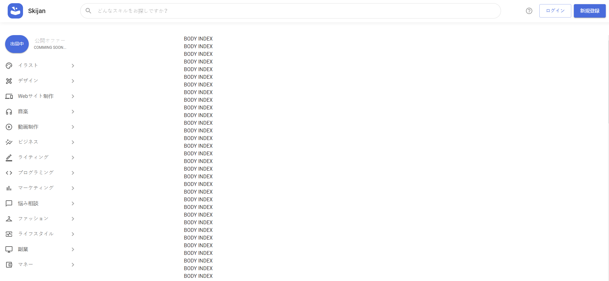
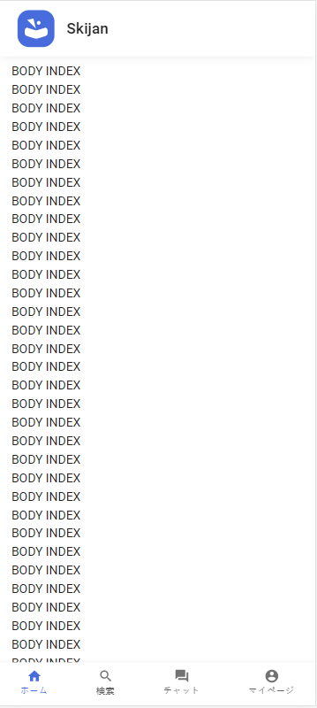
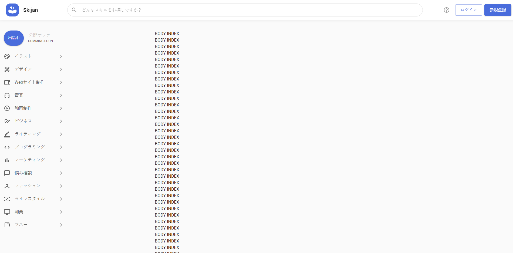
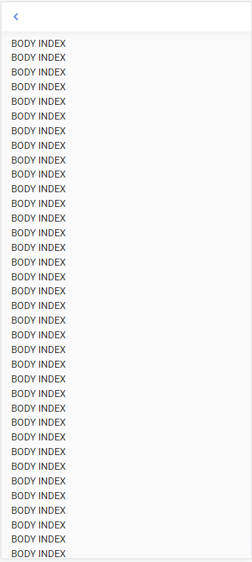
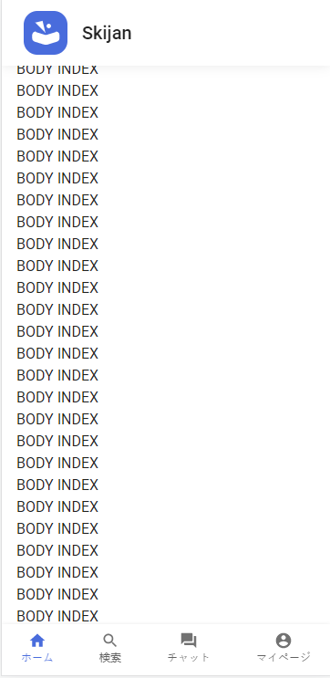
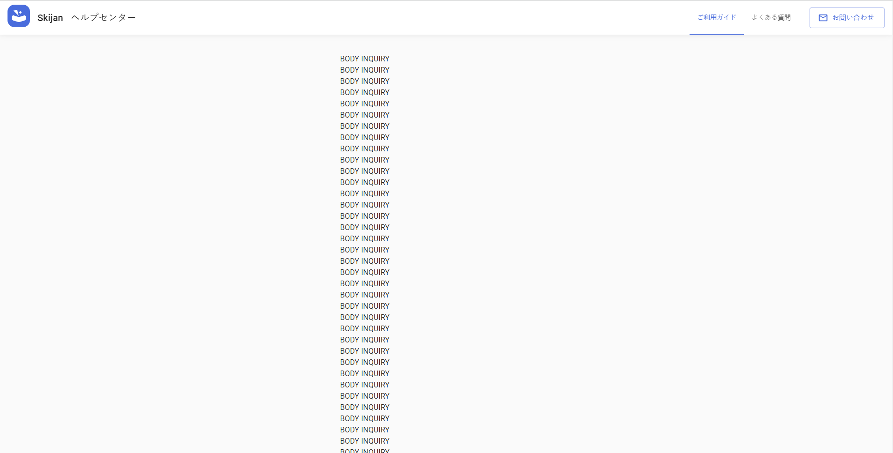

# A. GUI-SKIJAN
## How to start
### Development mode
```
$ cd packages/skijan
$ yarn start
```

### How to build staging at local
```
packages/skijan/next.config.js:14 rem code
  // cp.execSync(`${scr} ./modules/config.js`)

packages/skijan/package.json modify
  "preaws:build": "npx rimraf .next",
  "aws:build": "cross-env ENV=staging next build",
  
packages/skijan/index.js:11 modify
  before: const app = next({dev, hostname, port })
  after: const app = next({ hostname, port })
run: yarn aws:build
run: yarn aws
```
### Staging/production mode
```
$ cd packages/skijan
$ yarn aws:build
$ yarn aws
```

## Frontend check list
  - [ ] Determine which layout will be used, see more `How to use layout?`
  - [ ] Check re-render issue
  - [ ] Check scroll to input case error
  - [ ] Check value of color, font, etc should use value at `theme.config.ts` instead of hardcode
  - [ ] Check call API apply `ggjDebounce` function `common/utils.ts`, to prevent user send requests from multiple clicks
  - [ ] Check call API properly, see more `How to write code to communicate to API correctly?`
  - [ ] Do NOT use `array indices` as `key` prop
  - [ ] Upload image: check file extension, file size, number of file
  - [ ] Check response type using `TGgjRes` `app.d.ts`
  - [ ] API code must place at `store/xxxSlice.ts`
  - [ ] API response page not found `AppError.ECB404` packages/skijan/app.d.ts
  - [ ] Paging prop 'IPaging' packages/skijan/app.d.ts
  - [ ] Check whether appending request header for authorizing API, see more `How to append request when calling API?`

## Features
  - [x] Use AWS AppConfig
    ```
    packages\skijan\modules\config.js
    ```
  - [x] Global error & send slack
    At `packages\skijan\pages\_error.tsx`, invoke the function `hookRender` like the below.

    ```
    interface Props {
      userAgent?: string
      statusCode: number
    }

    const MyError: NextPage<Props> = (ctx) => {
      const statusCode: number = ctx.statusCode
      return <NextErrorComponent statusCode={statusCode} />
    }

    MyError.getInitialProps = async (ctx: NextPageContext) => {
      const errorInitialProps = await NextErrorComponent.getInitialProps(ctx)
      const { err, req, res } = ctx
      const statusCode = res ? res.statusCode : err ? err.statusCode : 404

      // if the error is status http 500, send slack
      if(statusCode === 500) {
        hookRender(err, req)
      }

      // other http status code
      return errorInitialProps
    }

    export default MyError

    ```
  - [x] [Material UI](https://mui.com/)
    - Setting breakpoint at `packages\skijan\pages\_app.tsx`.
  - [x] GGJ's config `next.config.js`\
    Default `serverRuntimeConfig` contains all configs
    ```
    module.exports = {
      publicRuntimeConfig: {
        // Will be available on both server and client
        MYSECRET: env.MYSECRET,
      },
    }
    ```
    - How to use
    ```
    import getConfig from 'next/config'
    import Image from 'next/image'

    // Only holds serverRuntimeConfig and publicRuntimeConfig
    const { serverRuntimeConfig, publicRuntimeConfig } = getConfig()

    // Will only be available on the server-side
    console.log(serverRuntimeConfig.mySecret)

    // Will be available on both server-side and client-side
    console.log(publicRuntimeConfig.staticFolder)

    function MyImage() {
      return (
        <div>
          <Image
            src={`${publicRuntimeConfig.staticFolder}/logo.png`}
            alt="logo"
            layout="fill"
          />
        </div>
      )
    }

    export default MyImage
    ```
    - Docs refernce: https://nextjs.org/docs/api-reference/next.config.js/runtime-configuration
  - [x] [Default alias](https://www.typescriptlang.org/tsconfig#paths)
  - [x] GGJ's axios `common\http.ts`
    ```
      import { http } from 'common/http'
      async fn(): Promise<void|object> {
        await http.get('/api/v3/surface/top')
      }
    ```
  - [x] [Typescript](https://vuejs.org/v2/guide/typescript.html)
  - [x] SEO: title, description,...
  - [x] health check `packages\skijan\index.js`
    ```
    ...
    server.get('/health', (req, res) => res.sendStatus(200))
    ...
    ```
  - [x] i18n `modules/i18n.js`
    - https://drive.google.com/drive/folders/1h3GxnCeojVRpA6b-GoJg1JRHJjmkete_?usp=sharing
    - How to use [i18n](https://www.notion.so/ggjungle/How-to-write-React-efficiency-7375694fa89b4ff9b613a9d6718775b9#f52445624b4043e59761ba19a541c720) in React?
    - How to use [translate sheet](https://www.notion.so/ggjungle/How-to-use-translate-sheet-correctly-c88145c4615f40438a234e78cefa55cf)?
    - How to translate i18n
    ```
    ...
    import { serverSideTranslations } from 'next-i18next/serverSideTranslations'
    import { useTranslation } from 'next-i18next'
    const ns = 'common@index' // next18n namespace, file name is 'common', and sheet name is 'index'
    ...

    function Home() {
      const router = useRouter()
      const { t } = useTranslation(ns)
      return (
        <>
          <h1 className='mt-3 mb-5'>{t('change-locale')}</h1>
        </>
      )
    }

    export async function getServerSideProps(ctx: NextPageContext) {
      const req = ctx.req as (IncomingMessage & { cookies: any })
      return {
        props: {
          ...(await serverSideTranslations(
            req.cookies.lang || 'ja', // get lang from cookie, if it null, default is 'ja'
            [ns] // name space
          )
          ),
        },
      }
    }

    export default Home
    ```
    - How to get i18n value
    ```
    import { useI18nContext } from 'contexts/I18nContext'
    ...
    const {locale} = useI18nContext()
    ```
  - [x] cookie-parser `packages\skijan\index.js`
  - [x] modify 404 error page
  - [ ] modify 500 error page
  - [x] How to use [store](https://www.notion.so/ggjungle/How-to-write-React-efficiency-7375694fa89b4ff9b613a9d6718775b9#0062320eb6704659be874138db905d55)?
  - [x] How to use [emotion css](https://www.notion.so/ggjungle/How-to-write-React-efficiency-7375694fa89b4ff9b613a9d6718775b9#a39aba18ff294b7ea26cb1f0eca27b4b)?
  - [x] How to use Loading Progress
    ``` 
    import { loadingOnHandler, loadingOffHandler } from 'contexts/LoadingContext'
    
    loadingOnHandler() or document.dispatchEvent(new CustomEvent('loadingOn')) to turn on loading
    loadingOffHandler() or document.dispatchEvent(new CustomEvent('loadingOff')) to turn off loading
    ```
  - [x] How to use Toast
    ```
    import { toastHandler } from 'contexts/ToastContext'
    ...
    toastHandler({ message:'', type: 'success' | 'error' | 'warning' })
    ```
  - [x] How to use layout?
    - Defined Layouts:
      - Layout Surface top:
        + On PC:
        
        + On Mobile Or Tablet: 
      - Layout Surface detail:
        + On PC: 
        + On Mobile Or Tablet: 
      - Layout MyPage top:
        + On PC: 
        + On Mobile Or Tablet: 
      - Layout MyPage detail:
        + On PC: 
        + On Mobile Or Tablet: 
      - Layout Inquiry:
        + On PC: 
        + On Mobile Or Tablet: 
    - Use Layout:
    ```
      Require register layout on each page
      /// Folder: pages/index
      import {  Surface } from 'components/layouts'
      import { ggjServerSideTranslations } from 'common/i18nUtils'
      import { NextRequest } from 'next/server'
      import { SurfaceLayout, nsSurfaceLayout } from 'components/layouts'
  
      export default function IndexPage() {
        return(
          <> {Array(100).fill(null).map((item, idx) => <div key={idx}>BODY INDEX</div>)}</>
        )
      }
  
      export async function getServerSideProps({req}: {req: NextRequest}) {
        const props = {
          props: {
            ...await ggjServerSideTranslations(req as NextRequest, [], nsSurfaceLayout),
          },
        }
        return { ...props }
      }
  
      IndexPage.Layout = SurfaceLayout
    ```
    ```
    Update settings layout if necessary
    ///Folder: pages/inquiry
    import { InquiryLayout } from 'components/layouts'
    import { ggjServerSideTranslations } from 'common/i18nUtils'
    import { NextRequest } from 'next/server'
    import { useLayoutContext } from 'context/layoutContext'
    import { useEffect } from 'react'
    import MailOutlineIcon from '@mui/icons-material/MailOutline'
    import Typography from '@mui/material/Typography'
  
    function titleHeader(text: string) {
      return (
        <>
          <MailOutlineIcon color="action" />
          <Typography ml={1} variant="subtitle1" color="inherit">
            <strong>{text}</strong>
          </Typography>
        </>
      )
    }
  
    export default function IndexPage() {
      const { updateLayoutSetting } = useLayoutContext()
      useEffect(() => {
        updateLayoutSetting({
          maxWidth: 500,
          backgroundColor: '#FAFAFA',
          title: titleHeader('お問い合わせ'),
        })
      }, [])
      return (
        <>
          {Array(100)
            .fill(null)
            .map((item, idx) => (
              <div key={idx}>BODY INQUIRY</div>
            ))}
        </>
      )
    }
    ```
  
    ```
    Persistent layout patterns in Next/js 
    - Remove re-rendering the entire UI whenever you click a link
  
    - Example :
      type ComponentWithPageLayout = AppProps & {
        Component: AppProps['Component'] & {
          PageLayout?: React.ComponentType
        }
      }   
      function App({ Component, pageProps }: ComponentWithPageLayout) {
        const theme = createTheme(themeConfig.light as ThemeOptions)
        return (
          <ThemeProvider theme={theme}>
            <CssBaseline />
            <CommonHead />
            <CommonLayout>
              {Component.PageLayout ? (
                <Component.PageLayout>
                  <Component {...pageProps} />
                </Component.PageLayout>
              ) : (
                <Component {...pageProps} />
              )}
            </CommonLayout>
          </ThemeProvider>
        )
      }
    ```
    - [x] How to write code to communicate to API correctly?
      ```
      // store/yourSlice.ts
      export const checkUserStatusApi = async (user: TUser) => {
        const {data} = await http.get<TType>(`api/your/v1/demo`)
        return data
      }
      ```
      ```
      // pages/your.tsx
      // case you are calling from client side
      // NEED try cache & show app error
      ...
      import { toastHandler } from 'contexts/ToastContext'
      import { loadingOnHandler, loadingOffHandler } from 'contexts/LoadingContext'
      ...
      try {
        loadingOnHandler()
        const {data, error} = await checkUserStatusApi({})
        if (error) {
          // do something with error
          return
        }
        // do success case
      } catch (e) {
        // show app error: try again later
        toastHandler({type: 'error'})
      } finally {
        loadingOffHandler()
      }
      ...
      ```
      ```
      // pages/your.tsx
      // case you are calling from server side
      // NO NEED to try cache & handle show app error
      ...
      export async function getServerSideProps({ req }: { req: NextRequest }) {
        const data = await http.get('/api/your/v1/demo')
        return {
          props: {
            data: data.data.data,
            ...(await ggjServerSideTranslations(req, [nsTran])),
          },
        }
      }
      ...
      ```
    - Learn more [layout](https://adamwathan.me/2019/10/17/persistent-layout-patterns-in-nextjs/)
  - [x] How to append request when calling API?
    ```
    import http, { appendGgjHeader } from 'common/http'
    ...
    export async function getServerSideProps({ req }: { req: NextRequest }) {
      const data = await http.get('/api/myaccount/v1/terms/operation', {
        headers: appendGgjHeader({ req }),
      })
      return {
        props: {
          data: data.data.data,
          ...(await ggjServerSideTranslations(req, nsTranSurfaceLayout)),
        },
      }
    }
    ```
  - [x] How to login using ip address?
    ```
    Replace 192.168.0.104 in example below with your ip

    guard-skijan
      .env
        SKJ_DOMAIN: 192.168.0.104
        SKJ_HOST_URL: 'http://192.168.0.104:8920'
    api-accounts
      .env
        SKJ_DOMAIN: '192.168.0.104'
        SKJ_HOST_URL: 'http://192.168.0.104:8920'
    api-skijan
      .env
        SKJ_HOST_URL: 'http://192.168.0.104:8920'
    ```

## Related library
- https://emotion.sh/docs/introduction
- https://github.com/isaachinman/next-i18next

## Old skeleton version
The old version is using nuxtjs, this have been removed at [this commit](https://github.com/gogojungle/surface.gogojungle.co.jp/commit/216717ab15dbdf4d807da5c6f3a8e0216de1c382)

# B. Principles and code style guide
This document is a recommendation, that will help we code easier to maintain, easier to read. All contribute to improve the codebase and this README are welcome.

## Skijan layouts
- Surface top
- Mypage top
- Inquiry (center layout)
- Surface details
- Mypage details
