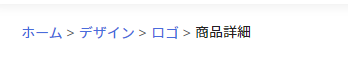

# GgjBreadcrumbs
## Image


## Basic usage
```
export default function index() {
  const data = [
    {
      title: 'Home Page',
      url: '/'
    },
    {
      title: 'Skill',
      url: '/skill'
    },
    {
      title: 'Edit', 
      // doesn't have url == unclickable breadcrumb
    },
  ]
  return (
    <GgjBreadcrumbs data={data}/>
  )
}
```
## Props
<table>
<tr>
<td> <strong>Props</strong> </td> <td> <strong>Description</strong> </td>
</tr>
<tr>
<td> data </td>
<td>

```
{
  title: string
  url?: LinkProps['href']
  linkProps: Omit<LinkProps, 'href'>
}[]
```
- The `title` is text of breadcrumb item.
- The `url` type may be a string url, or an url object. Detail `url object` read at `https://nextjs.org/docs/api-reference/next/link#with-url-object`
- `The linkProps` the same with props of next link, using for inject props for the `Link` component.
  Detail read at https://nextjs.org/docs/api-reference/next/link
</td>
</tr>
<tr>
<td> breadcrumbStyle </td>
<td>

Custom style for breadcrumb item
```
={css`
  color: '...',
  font-size: '...',
  padding: '...'
`}
```

</td>
</tr>
<tr>
<td> <i>StackProps</i> </td>
<td>

**Every** props used on Stack component can be used here 
(these style are applied for breadcrumbs container only)
```
css={css`....`}
p={...}
spacing={...}
direction={...}
```

</td>
</tr>
</table>

For detail about types of props, get it at code base. `packages/skijan/components/commons/GgjBreadcrumbs/index.tsx`
## Customization
```
export default function index() {
  const data = [
    {
      title: 'Home Page',
      url: '/'
    },
    {
      title: 'Skill',
      url: '/skill'
    },
    {
      title: 'Edit',
      // doesn't have url == unclickable breadcrumb
    },
  ]
  return (
    <GgjBreadcrumbs
      data={data} 
      css={css`background-color: #FAFAFA;`}  // Add custom style for container here
      mt={2}
      mb={3}
      p={4}
      breadcrumbStyle={css` color: #222222;`}  // Add custom style for breadcrumb item here
    />
  )
}
```
