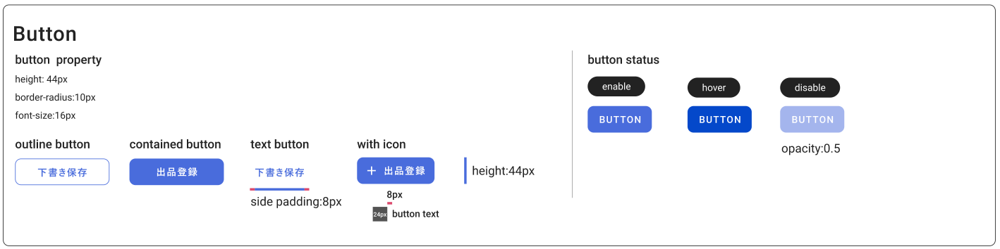

#GgjButton
## Prepare
```
Have to use button

1/ GgjContainButton
import { GgjContainButton} from 'components/commons/GgjButton'
export default function IndexPage() {
  const click = () => {
    console.log('click')
  }
  return (
    <>
      <GgjContainButton onClick={click}>
        BUTTON
      </GgjContainButton>     
    </>
  )
}

2/ GgjOutlineButton
import { GgjOutlineButton} from 'components/commons/GgjButton'
export default function IndexPage() {
  const click = () => {
    console.log('click')
  }
  return (
    <>
      <GgjOutlineButton onClick={click}>
        BUTTON
      </GgjOutlineButton>     
    </>
  )
}

3/ GgjTextButton
import { GgjTextButton} from 'components/commons/GgjButton'
export default function IndexPage() {
  const click = () => {
    console.log('click')
  }
  return (
    <>
      <GgjTextButton onClick={click}>
        BUTTON
      </GgjTextButton>     
    </>
  )
}

4/ Disabled button
import { GgjContainButton} from 'components/commons/GgjButton'
export default function IndexPage() {
  const click = () => {
    console.log('click')
  }
  return (
    <>
      <GgjContainButton onClick={click} disabled>
        BUTTON
      </GgjContainButton>     
    </>
  )
}

5/ Customized css
import { GgjContainButton} from 'components/commons/GgjButton'
export default function IndexPage() {
  const click = () => {
    console.log('click')
  }
  return (
    <>
      <GgjContainButton onClick={click} cssStr='width:100%'>
        BUTTON
      </GgjContainButton>     
    </>
  )
}

6/ Add icon in button
import { GgjContainButton, MARGIN_RIGHT_ICON} from 'components/commons/GgjButton'
import AddIcon from '@mui/icons-material/Add'
export default function IndexPage() {
  const click = () => {
    console.log('click')
  }
  return (
    <>
      <GgjContainButton onClick={click} cssStr='width:100%'>
       <AddIcon
          css={css`
            margin-right: ${MARGIN_RIGHT_ICON};
          `}
        />
        BUTTON
      </GgjContainButton>     
    </>
  )
}


Design Common Button:
```
