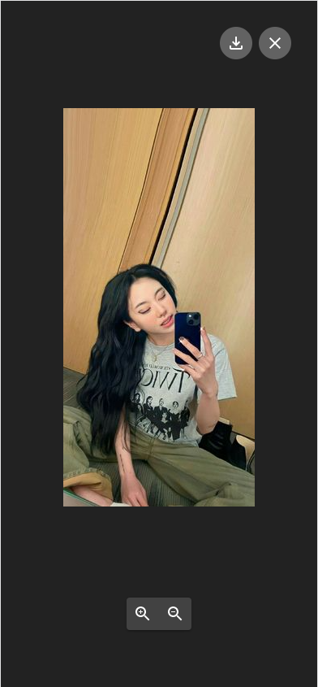
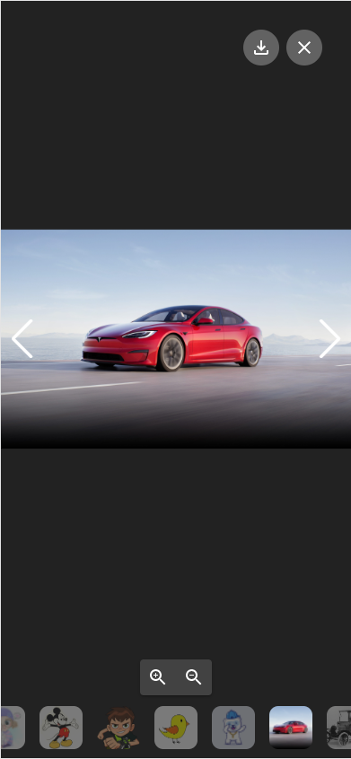

#How to use GgjChatImageViewer?

##Step 1) add slice : ImageViewerSlice and component into page
```

import  {slice as imageViewerSlice , ns as nsImageViewer , GgjChatImageViewer} from 'components/commons/GgjChatImageViewer'

export default function IndexPage() {
  const {updateLayoutSetting} = useLayoutContext()
  reducerManager.add(imageViewerSlice)
  useEffect(() => {
    updateLayoutSetting({
      maxWidth: 1560
    })
    return function () {
      reducerManager.remove(nsImageViewer)
    }
  }, [])

  return (
   <GgjChatImageViewer />
  )
}
```
## Step 2) You need dispatch action open image viewer
```
import {actions as actionImageViewer } from 'components/commons/GgjChatImageViewer'
import {useAppDispatch} from 'store/hooks'

 const dispatch = useAppDispatch()
  const handleClickImages = useCallback((item : IImageViewer) => {
    dispatch(actionImageViewer.setViewingImages([item]))
  }, [])
  
  OR 
  
 const handleClickFileItem = (item : FileTypes) => {
    const clickedImageIndex = findImageIndex(item.url || '')
    dispatch(actionImageViewer.setFirstViewingImageIndex(clickedImageIndex === -1 ? 0 : clickedImageIndex))
    dispatch(actionImageViewer.setViewingImages(imagesList))

} 
```

