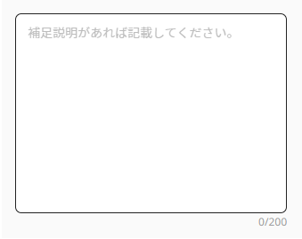

#GgjCountText
## Prepare
```
1/ Have to use in form provider

const methods = useForm<IFormValues>({reValidateMode: 'onSubmit'})

const onSubmit = ({largeCategoryId, middleCategories, description}: IFormValues) => {
  console.log('onSubmit', largeCategoryId, middleCategories, description)
}

<FormProvider {...methods}>
  <form onSubmit={methods.handleSubmit(onSubmit)} action="">
    <GgjCountText name={name} max={rules.maxLength} isError={isError} />
  </form>
<FormProvider>

2/ If you using GgjInputCountText is a input + count
```
## Basic usage
```
import GgjCountText from '../GgjCountText'

<GgjCountText name={name} max={rules.maxLength} isError={isError} />

```
## Demo

<br/>
</br>
<small>If stuck please contact <a>https://github.com/stupidguy176</a></small>
