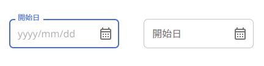

#GgjDatePicker
## UI image



## Basic usage
```
import GgjDatePicker from 'components/commons/GgjDatePicker'

export default function IndexPage() {
  const { control, formState: {errors}} = useForm({
    reValidateMode: 'onChange',
  })

  return(
    <FormControl variant="outlined" error={!!Object.keys(errors['test'] || {}).length}>
      <Controller
        control={control}
        name="test"
        aria-describedby={'component-test-text'}
        defaultValue={null}
        render={({ field: { value, onChange, ref,...rest } }) => {
          return (
            <GgjDatePicker
              value={value}
              label="開始日"
              onChange={onChange}
              datePickerRef={ref}
              inputStyles={css`
                width: 180px;
              `}
              {...rest}
            />
          )
        }}
      />
      {!!Object.keys(errors[test] || {}).length && <FormHelperText id="component--text">Warning Text</FormHelperText>}
    </FormControl>
  )
}
```
## Props
Every props of DatePicker can use as props here
```
{
  isError?: boolean
  datePickerRef?: RefCallBack               // for react-hook-form focus on error validation
  onChange: (arg : number | null) => void   // event of react-hook-form controller
  value: number                             // value: of react-hook-form controller
  inputStyles?: SerializedStyles            // style for TextField
  placeholder?: string
  ...rest: DatePickerProps                  // props of DatePicker component
} 
```


## Customization
```
  <FormControl variant="outlined" error={!!Object.keys(errors['test'] || {}).length}>
    <Controller
      control={control}
      name="test"
      aria-describedby={'component-test-text'}
      defaultValue={null}
      render={({ field: { value, onChange, ref,...rest } }) => {
        return (
          <GgjDatePicker
            value={value}
            label="開始日"
            onChange={onChange}
            datePickerRef={ref}
            components={{               // custom icon open date picker
              OpenPickerIcon: CalendarMonthOutlined
            }}
            maxDate={new Date(...)}     // custom maxDate
            placeholder={t(2)}
            inputStyles={css`           // style for input
              width: 180px;
            `}
            {...rest}
          />
        )
      }}
    />
    {!!Object.keys(errors[test] || {}).length && <FormHelperText id="component--text">Warning Text</FormHelperText>}
  </FormControl>
```
