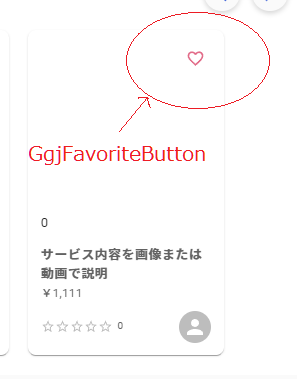
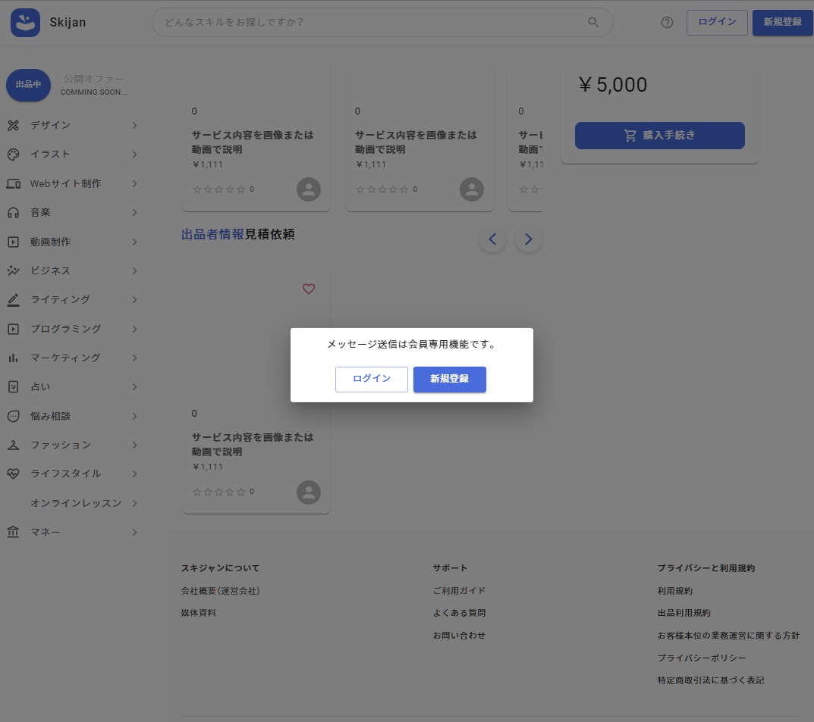

# Description

## Props
| Props        | Description              |
|--------------|--------------------------|
| `id`         | skill id                 |
| `isFavorite` | boolean, favorite status |

## UI
- Using for favorite/un-favorite skill product.
- In case the UI have some `GgjFavoriteButton` with the same skill id,
  favorite status will be sync between us.



- In case user is not login, show modal and ask user redirect to /login.
  This modal will be shown


# How to use
- Step 1:
Add namespace nsGgjFavoriteButton
```
import {nsGgjFavoriteButton} from 'components/commons/GgjFavoriteButton'

export const getServerSideProps = async ({req}: any) => {
  return {
    props: {
      ...(await ggjServerSideTranslations(<req>, [nsGgjFavoriteButton], <layout ns>))
    }
  }
}
```
- Step 2:
Add component and needed props
```
function PageComponent() {
  ...
  const data = {
    skillId: 1,
    isFavorite: 0.
  }
  ...
  return (
    <GgjFavoriteButton
      id={data.skillId}
      isFavorite={data.isFavorite === 1}
    />
  )
}
```

#### HERE IS COMPLETED EXAMPLE CODE:
```
import {ggjServerSideTranslations} from 'common/i18nUtils'
import {GgjFavoriteButton, nsGgjFavoriteButton} from 'components/commons/GgjFavoriteButton'
import {nsTranSurfaceDetailLayout, SurfaceDetailLayout} from 'components/layouts'
import {NextRequest} from 'next/server'

function PageComponent() {
  const data = {
    skillId: 1,
    isFavorite: 0.
  }
  return (
    <GgjFavoriteButton
      id={data.skillId}
      isFavorite={data.isFavorite === 1}
    />
  )
}

PageComponent.Layout = SurfaceDetailLayout
export default PageComponent

export const getServerSideProps = async ({req}: any) => {
  return {
    props: {
      ...(await ggjServerSideTranslations(
        req as unknown as NextRequest,
        [nsGgjFavoriteButton],
        nsTranSurfaceDetailLayout
      ))
    }
  }
}

```
