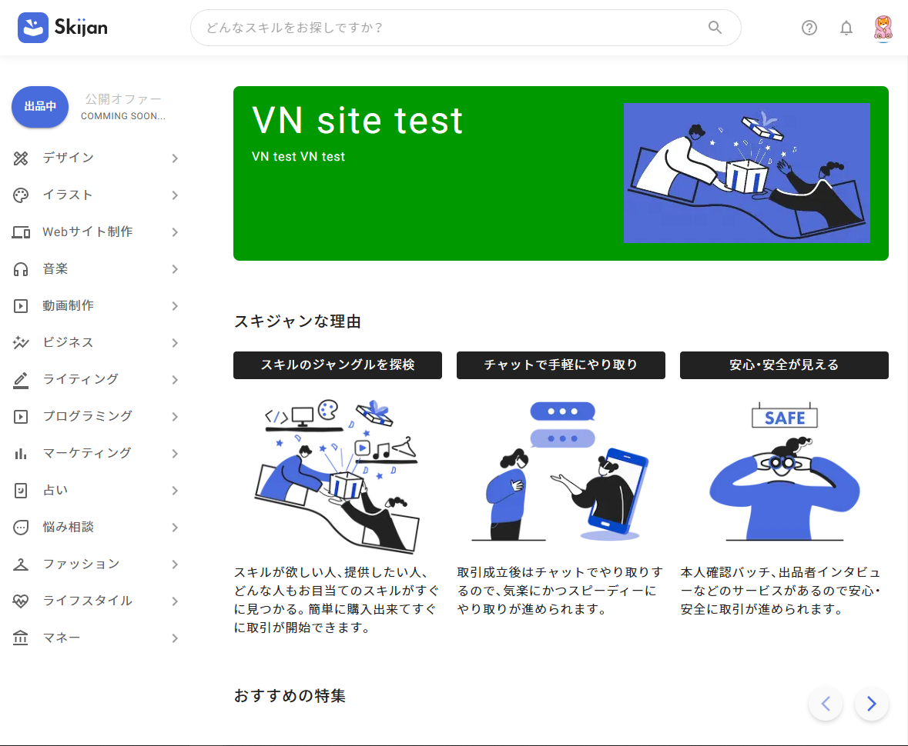
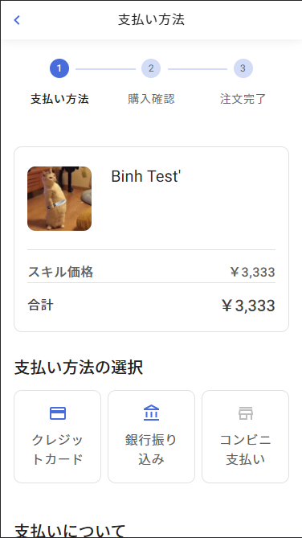

# Default Header for desktop 
- Behavior: Position fixed
- Include: Skijan logo, except children
- Devices: Desktop and Mobile
- Usage:
```
import {GgjDesktopHeader} from '../../commons/GgjHeader'

<GgjDesktopHeader>
  {item}
</GgjDesktopHeader>
```


# Default Header for mobile (mostly in detail page)
- Behavior: Position fixed, Auto hide on scroll
- Include: Back button (default: ```() => router.back()```), title (optional), no children
- Devices: Mobile (Mostly)
- Usage:
```
import {GgjMobileHeader} from '../../commons/GgjHeader'

<GgjMobileHeader/>
```


# Skijan logo
- Usage:
```
import {SkijanLogo} from '../../commons/GgjHeader'

<SkijanLogo/>
```

