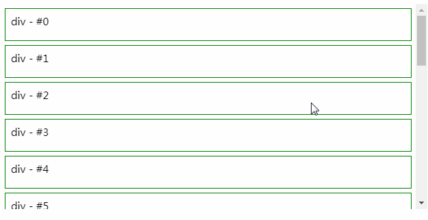

#GgjInfinite

## Basic usage

```
import InfiniteScrollCommon from 'components/commons/GgjInfinite'

const list = [{key1: value}, {key2: value}, ...]
<InfiniteScrollCommon
    height={400}
    hasMore={true}
    next={handleCallAPI}
    dataLength={list.length}>
    {list?.length > 0 && list.map((values, index) => {
        return (...)
    })}
</InfiniteScrollCommon>
```

## Demo

