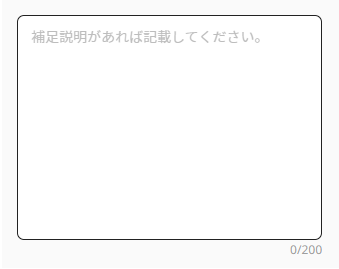

#GgjInputCountText
## Prepare
```
1/ Have to use in form provider

const methods = useForm<IFormValues>({reValidateMode: 'onSubmit'})

const onSubmit = ({largeCategoryId, middleCategories, description}: IFormValues) => {
  console.log('onSubmit', largeCategoryId, middleCategories, description)
}

<FormProvider {...methods}>
  <form onSubmit={methods.handleSubmit(onSubmit)} action="">
    <GgjInputCountText name="myname" rules={{maxLength: 200}} isMultiline={true} rows={10} placeholder="myplaceholder" />
  </form>
<FormProvider>

2/ Input have 2 options normal and textarea belong isMultiline
```
## Basic usage
```
import GgjInputCountText from 'components/commons/GgjInputCountText'

<GgjInputCountText name="myname" rules={{maxLength: 200}} isMultiline={true} rows={10} placeholder="myplaceholder" />

```
## Customization
```
textarea

<GgjInputCountText name="myname" rules={{maxLength: 200}} isMultiline={true} rows={10} placeholder="myplaceholder" />

normal input

<GgjInputCountText name="myname" rules={{maxLength: 200}} placeholder="myplaceholder" />

```
## Demo

</br>
<small>If stuck please contact <a>https://github.com/stupidguy176</a></small>
