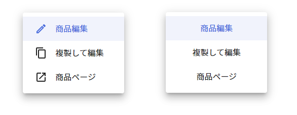

# GgjMenu
## Image


## Basic usage
```
export default function index() {
  const [isOpen, setIsOpen] = useState(false)
  const buttonRef = useRef(null)
  const data = [
    {
      icon: <EditOutlined />,
      title: '商品編集',
      onClick: () => console.log('hihi')
    },
    {
      icon: <ContentCopy />,
      title: '複製して編集',
      onClick: () => console.log('hihi')
    },
    {
      icon: <OpenInNewOutlined />,
      title: '商品ページ',
      onClick: () => console.log('hihi')
    },
  ]
  return (
    <>
      <Button 
        ref={buttonRef}
        onClick={setIsOpen(true)}
      >
        Open Menu Button
      </Button>
      
      <GgjMenu 
        data={data}
        open={true}
        anchorEle={buttonRef.current}
        onClose={setIsOpen(false)}
       />
    </>
  )
}
```
## Props
<table>
<tr>
<td> <strong>Props</strong> </td> <td> <strong>Description</strong> </td>
</tr>
<tr>
<td> data </td>
<td>

```
data: {
  icon?: JSX.Element
  title: string
  onClick: () => void
}[]
```

</td>
</tr>
<tr>
<td> open </td>
<td>

```
open: boolean
```
</td>
</tr>
<tr>
<td> anchorEle </td>
<td>

```
anchorEle: HTMLElement
```
</td>
</tr>
<tr>
<tr>
<td> onClose </td>
<td>

```
onClose: function
```
</td>
</tr>
<tr>
<td> itemStyles </td>
<td>

Custom style for Menu item
```
={css`
  color: ...;
  font-size: ...;
  padding: ...;
  text-align: ...;
`}
```

</td>
</tr>
<tr>
<td> css </td>
<td>

Custom style for container
```
css={css`
  padding: ...;
  margin: ...;
  width: ...;
  max-width: ...;
  @media and (...){}
`}
```

</td>
</tr>
</table>

For detail about types of props, get it at code base. `packages/skijan/components/commons/GgjMenu/index.tsx`
## Customization
```
export default function index() {
  const [isOpen, setIsOpen] = useState(false)
  const buttonRef = useRef(null)
  
  const data = [
    const data = [
    {
      icon: <EditOutlined />,
      title: '商品編集',
      onClick: () => console.log('hihi')
    },
    {
      icon: <ContentCopy />,
      title: '複製して編集',
      onClick: () => console.log('hihi')
    },
    {
      icon: <OpenInNewOutlined />,
      title: '商品ページ',
      onClick: () => console.log('hihi')
    },
  ]
  return (
    <GgjMenu
      data={data}
      open={true}
      anchorEle={buttonRef.current}
      onClose={setIsOpen(false)}
      itemStyles={css `color: #626262;`}  // style for menu item
      css={css`margin-bottom: 12px;`}     // style for menu container
    />
  )
}
```
