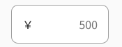

#GgjInputWithCount
## UI image



## Basic usage
Use GgjPriceInput as a normal OutlinedInput
```
import GgjPriceInput from 'components/commons/GgjPriceInput'

<FormControl variant="outlined" error={isError}>
  <Controller
    control={control}
    name={name}
    aria-describedby={`component-${name}-text`}
    defaultValue={defaultValue}
    rules={rules}
    render={({ field }) => {
      return (
        <GgjPriceInput {...field} />
      )
    }}
  />
  {isError && <FormHelperText css={css `width: 200px;`}>
    {validateText}
  </FormHelperText>}
</FormControl>
```
## Props
Every props of OutlinedInput can use as props here
```
  Require to pass {...field} from Controller (react-hook-form) as props
  Example: 
  <Controller
    render={({ field }) => {
      return (
        <GgjPriceInput {...field} />
      )
    }}
  />
```

## Customization
```
  <Controller
    render={({ field }) => {
      return (
        <GgjPriceInput
          css={css``}                                               // custom css here 
          startAdornment={
            <InputAdornment position="start">￥</InputAdornment>    // customize position of currency sign
          }
          {...field}
        />
      )
    }}
  />

```
