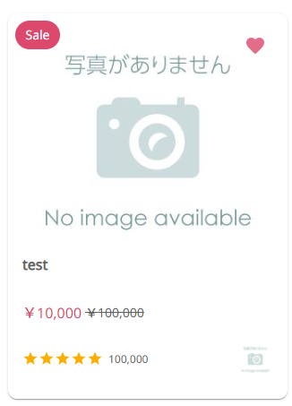

#GgjProductBox

## Basic usage
### Step 1
```
import GgjProductBox, { IGgjSKillItem, nsGgjProductBox } from 'components/commons/GgjProductBox'

const mockData: IGgjSKillItem = {
    title: 'test',
    price: 100000,
    isSpecialDiscount: true,
    specialDiscountPrice: 100000,
    rating: 100000,
    favorite: true,
    path: '/',
    skillId: number
    userId: number
    favoriteHandler: () => customHandler(),
  }

<GgjProductBox data={mockData} />
```

### Step 2
```
Add namespace nsGgjProductBox
```
import {nsGgjProductBox} from 'components/commons/GgjProductBox'

export const getServerSideProps = async ({req}: any) => {
  return {
    props: {
      ...(await ggjServerSideTranslations(<req>, [...nsGgjProductBox], <layout ns>))
    }
  }
}
```

## Demo

