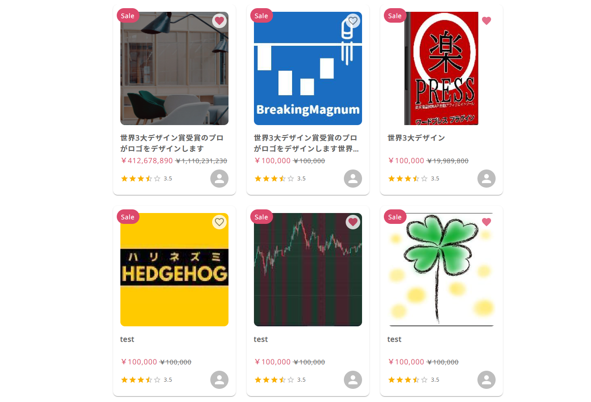

#GgjProductBox

## Basic usage
### Step 1
```
import { IGgjSKillItem } from 'components/commons/GgjProductBox'
import GgjProductBoxWrapper from '../components/commons/GgjProductBoxWrapper'

const listData: IGgjSKillItem[] = [
  {
    title: '世界3大デザイン賞受賞のプロがロゴをデザインします',
    price: 1110231230,
    isSpecialDiscount: true,
    specialDiscountPrice: 412678890,
    rating: 3.5,
    favorite: true,
    path: '/skill/1',
    skillId: 1
    userId: 12
  }
  ]

<GgjProductBoxWrapper list={listData} />
```
### Step 2
```
Add namespace nsGgjProductBoxWrapper
```
import {nsGgjProductBoxWrapper} from 'components/commons/GgjProductBoxWrapper'

export const getServerSideProps = async ({req}: any) => {
  return {
    props: {
      ...(await ggjServerSideTranslations(<req>, [...nsGgjProductBoxWrapper], <layout ns>))
    }
  }
}
```

## Demo

