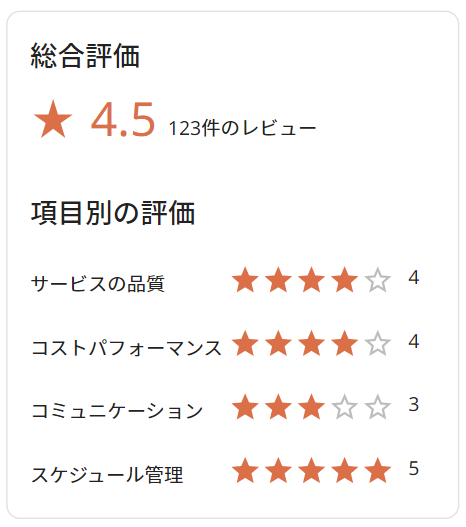

#GgjReviewSummary

## Basic usage

```
//Prototype before implement API

import GgjReviewSummary, { IGgjReviewSummary } from 'components/commons/GgjReviewSummary'

const mockData: IGgjReviewSummary = {
    reviewStars: 4.5,
    count: 123,
    reviewDetails: [
      {
        reviewType: 'サービスの品質',
        reviewStars: 4.0,
      },
      {
        reviewType: 'コストパフォーマンス',
        reviewStars: 4.5,
      },
      {
        reviewType: 'コミュニケーション',
        reviewStars: 3.5,
      },
      {
        reviewType: 'スケジュール管理',
        reviewStars: 5.0,
      },
    ],
  }

<GgjReviewSummary data={mockData} />
```

## Demo

