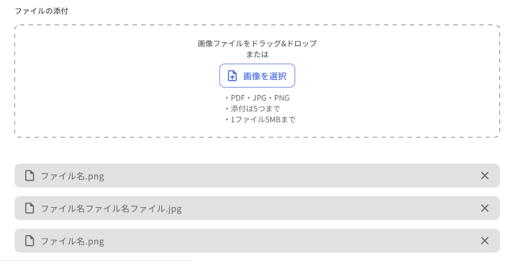

#How to use GgjUploadImagesOrFiles?

## 1) Upload files not replace url
```
import {nsTranSurfaceLayout, SurfaceLayout} from 'components/layouts'
import {ggjServerSideTranslations} from 'common/i18nUtils'
import {NextRequest} from 'next/server'
import {
  dispatchEvent,
  EventBusAction,
  fileType,
  getFiles,
  GgjUploadImagesOrFiles,
  nsTranUploadFiles,
  uploadFiles,
  uploadResponse,
  FileTypes
} from '../components/commons/GgjUploadImagesOrFiles'

import {GgjContainButton} from '../components/commons/GgjButton'

export default function IndexPage() {
  const value: Array<FileTypes> = []
  let lstFiles: Array<FileTypes>  = []
  //let lstRemoveFiles: any[] = []

  const handleChange = (listFiles: Array<FileTypes> ) => {
    lstFiles = listFiles
    console.log('listFiles', lstFiles)
  }
  const handleRemove = (listRemoveFiles: Array<FileTypes> ) => {
    //  lstRemoveFiles = listRemoveFiles
    console.log('listRemoveFiles', listRemoveFiles)
  }

  const handleUpload = async () => {
    if (lstFiles && lstFiles.length) {
      const results = (await getFiles(lstFiles)) as Array<fileType>
      if (results && results.length) {
        const files = results.filter(p => p.file)
        if (files && files.length) {
          const formData = new FormData()

          files.forEach((p) => {
            const file = p.file as Blob
            formData.append('file', file)
          })
          const response = (await uploadFiles(`skijan/mypage/message/${1}`, formData)) as uploadResponse
          if (response && response.error) {
            //TODO:Thao, show error
            return console.log(response.error)
          }
          for (const item of files) {
            URL.revokeObjectURL((item as fileType).url)
          }
          console.log(response)
          //Note: Thao, call function this if you need reset data in tool upload
          dispatchEvent(EventBusAction.ResetUploadImagesAndFiles, null)
        }
      }
    }
  }

  return (
    <>
      <GgjUploadImagesOrFiles onChange={handleChange} onRemove={handleRemove} value={value} maxFiles={5}/>
      <GgjContainButton onClick={handleUpload}>Upload</GgjContainButton>
    </>
  )
}

export async function getServerSideProps({req}: { req: NextRequest }) {
  const props = {
    props: {
      ...(await ggjServerSideTranslations(
        req as NextRequest,
        [nsTranUploadFiles],
        nsTranSurfaceLayout
      )),
    },
  }
  return {...props}
}

IndexPage.Layout = SurfaceLayout

```
## 2) Upload files replace url
```
export default function IndexPage() {
  const value: Array<FileTypes> = []
  let lstFiles: Array<FileTypes>  = []
  //let lstRemoveFiles: any[] = []

  const handleChange = (listFiles: Array<FileTypes> ) => {
    lstFiles = listFiles
    console.log('listFiles', lstFiles)
  }
  const handleRemove = (listRemoveFiles: Array<FileTypes> ) => {
    //  lstRemoveFiles = listRemoveFiles
    console.log('listRemoveFiles', listRemoveFiles)
  }
   const handleUpload = async () => {
    if (lstImages.length) {
    
      //Call api stream images to folder and replace urls
      const result = await handleReplaceFiles(`skijan/mypage/message/${1}`, lstImages, uploadImages)
      if (result.error) {
        //TODO:Thao, Show error
      }
      lstImages = result.lstImages
    }

    if (lstRemoveImages && lstRemoveImages.length) {
      // Call api remove images if list images not empty
      const result = await removeImages(`url/${1}`, lstRemoveImages.map(p => p.number))
      if (result && result.error) {
        //TODO:Thao, Show Error
      }
    }
    
  }

  return (
    <>
      <GgjUploadImagesOrFiles onChange={handleChange} onRemove={handleRemove} value={value} maxFiles={2}/>
      <GgjContainButton onClick={handleUpload}>Upload</GgjContainButton>
    </>
  )
}
```
## Props:
```
function GgjUploadImagesOrFiles(props: {
  maxSize: number,
  maxFiles: number,
  acceptType: string,
  onChange: (listFiles: Array<FileTypes>) => void,
  onRemove: (listRemoveFiles: Array<FileTypes>) => void,
  value: Array<FileTypes>
})
```

