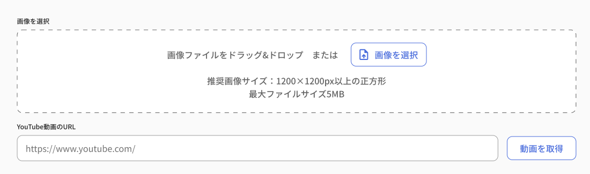

#GgjUploadImagesOrYoutube

## How to use GgjUploadImagesOrYoutube?
```import {nsTranSurfaceLayout, SurfaceLayout} from 'components/layouts'
import {ggjServerSideTranslations} from 'common/i18nUtils'
import {NextRequest} from 'next/server'
import {
  GgjUploadImagesOrYoutube,
  handleReplaceImages,
  nsTranUploadImages,
  removeImages,
  uploadImages,

} from '../components/commons/GgjUploadImagesOrYoutube'

import {GgjContainButton} from '../components/commons/GgjButton'
import {ImageTypes, YoutubeTypes} from '../components/commons/GgjUploadImagesOrYoutube/UploadImagesOrYoutubeContext'

export default function IndexPage() {
  const value = ''
  // const value = ''
  /* eslint-disable @typescript-eslint/no-explicit-any */
  let lstImages: Array<ImageTypes|YoutubeTypes> = []
  /* eslint-disable @typescript-eslint/no-explicit-any */
  let lstRemoveImages: Array<ImageTypes> = []
  /* eslint-disable @typescript-eslint/no-explicit-any */
  const handleChange = (listImages:Array<ImageTypes|YoutubeTypes>) => {
    lstImages = listImages
  }
  /* eslint-disable @typescript-eslint/no-explicit-any */
  const handleRemove = (listImageRemove: Array<ImageTypes>) => {
    lstRemoveImages = listImageRemove
  }

  const handleUpload = async () => {
    if (lstImages.length) {
      const result = await handleReplaceImages(`skijan/mypage/display/skill/banner/${1}`, lstImages, uploadImages)
      if (result.error) {
        //TODO:Thao, Show error
      }
      lstImages = result.lstImages
    }

    if (lstRemoveImages && lstRemoveImages.length) {
      const newArray = lstRemoveImages.map((p:ImageTypes ) => p.number as string)
      const result = await removeImages(`skijan/mypage/display/skill/banner/${1}`,newArray)
      if (result && result.error) {
        //TODO:Thao, Show Error
      }
    }
    //TODO: Thao, need convert to json string
    console.log(lstImages)
    console.log(JSON.stringify(lstImages))
  }

  return (
    <>
      <GgjUploadImagesOrYoutube onChange={handleChange} onRemove={handleRemove} value={value} maxFiles={2}/>
      <GgjContainButton onClick={handleUpload}>Upload</GgjContainButton>
    </>
  )
}

export async function getServerSideProps({req}: { req: NextRequest }) {
  const props = {
    props: {
      ...(await ggjServerSideTranslations(
        req as NextRequest,
        [nsTranUploadImages],
        nsTranSurfaceLayout
      )),
    },
  }
  return {...props}
}

IndexPage.Layout = SurfaceLayout


```
## Props:
```
function UploadImagesOrYoutube(props: {
  maxSize: number,
  maxFiles: number,
  acceptType: string,
  onChange: (listImages: Array<ImageTypes|YoutubeTypes>) => void,
  onRemove: (listImageRemove: Array<ImageTypes>) => void,
  isMobile: boolean,
  value: string
})
```

