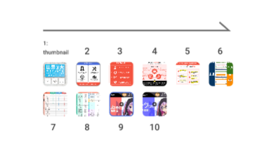
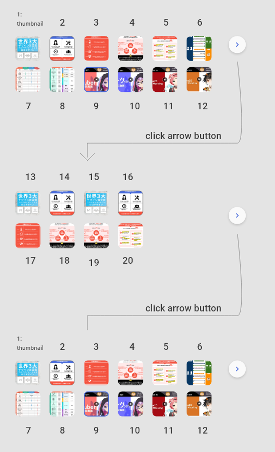

# SkillTopSlider
- This component get data input from store
- Data input type at `packages/skijan/store/skillSlice.ts` > `TAPIResObject['generalInfoSkill']['url']`

# NOTE:

Because swiper is not support for this logic show, I have created a function to mapping
`real position (originPosition) of swiper` to expected position `(computedPostion)`.

Detail at 

`packages/skijan/components/pages/skill/[id]/SkillTopSlider/dataMapping.ts`

and 

`packages/skijan/components/pages/skill/[id]/SkillTopSlider/ThumbSliders.tsx`

## Logic show item
### Number of items less than 12 (n <= 12)

### Number of items more than 12 (n > 12)

### In mobile, items is 1 row. No need mapping.
